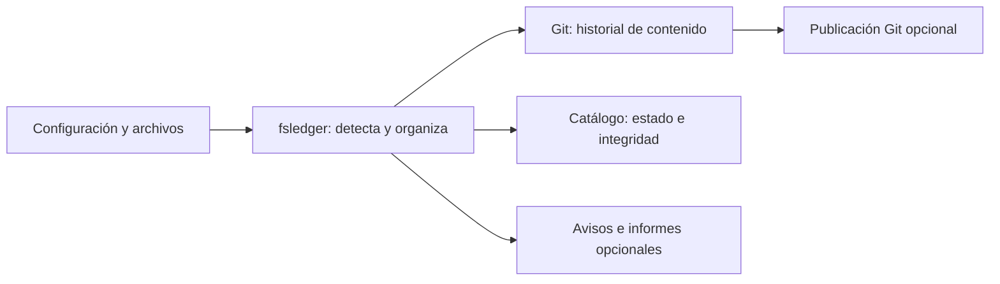

# fsledger

**Historial de cambios, integridad de archivos y avisos para tus servidores Linux.**

fsledger registra cómo evolucionan la configuración y los archivos de tus servicios.
Puedes conservar su contenido en Git, comprobar su integridad sin copiarlo o combinar
ambas opciones. Cuando el sistema proporciona esa información, añade el usuario y el
proceso observados para ayudarte a investigar qué cambió.

## Contenido

- [Para qué sirve](#para-qué-sirve)
- [Qué aporta](#qué-aporta)
- [Comparación con herramientas similares](#comparación-con-herramientas-similares)
- [Arquitectura](#arquitectura)
- [Requisitos](#requisitos)
- [Instalación](#instalación)
- [Primeros pasos](#primeros-pasos)
- [Configuración](#configuración)
- [Uso diario](#uso-diario)
- [Protección de datos](#protección-de-datos)
- [Licencia](#licencia)

## Para qué sirve

- **Entender un cambio de configuración.** Conserva versiones de `/etc` y de la
  configuración de tus aplicaciones para comparar el estado anterior y el actual.
- **Vigilar sitios web y servicios.** Detecta cambios de contenido, permisos,
  propietarios y otros atributos, y contrástalos con una referencia aprobada.
- **Revisar actividad sin seguir cada evento.** Recibe avisos agrupados o informes
  programados con las rutas afectadas y los cambios observados.
- **Separar necesidades por servicio.** Guarda en Git la configuración que quieres
  versionar y usa inventarios de metadatos para árboles cuyo contenido no necesitas
  archivar.
- **Compartir un historial fuera del servidor.** Publica los repositorios en tu
  servidor Git y, si lo habilitas expresamente, aplica cambios de una rama de confianza.

## Qué aporta

- **Historial automático en Git.** Cada repositorio conserva una copia independiente
  de sus fuentes, con commits agrupados y rutas reconocibles. No añade `.git` a los
  directorios de las aplicaciones.
- **Integridad con aprobación explícita.** Compara hashes y atributos con una referencia
  aprobada o con la observación anterior. SHA256 es el algoritmo predeterminado.
- **Contexto para investigar.** Utiliza la información disponible de fanotify, `/proc`
  y Linux Audit para enriquecer los cambios con usuario y proceso. Si no puede identificar
  al actor, sigue registrando el cambio como desconocido.
- **Detección adaptada al entorno.** Combina fanotify, inotify y reconciliación, o utiliza
  escaneos por intervalo o cron cuando prefieres un recorrido programado.
- **Control del ruido.** Filtra avisos por usuario, comando o ruta, agrupa notificaciones
  y aplaza commits de cambios frecuentes sin perder la última versión observada pendiente.
- **Avisos e informes.** Envía alertas por correo o Slack y resúmenes programados por
  correo. Las colas pendientes sobreviven a los reinicios.
- **IA opcional.** Añade resúmenes a los commits o a los informes, con selección de rutas
  y reglas de ocultación antes de enviar información al proveedor.
- **Operación desde la CLI.** Valida la configuración, consulta el estado, diagnostica
  capacidades, revisa diferencias y aprueba cambios. Incluye integración con OpenRC y systemd.

## Comparación con herramientas similares

Estas herramientas cubren necesidades relacionadas. La elección depende de si buscas
automatizar Git, gestionar `/etc` o verificar la integridad de los archivos.

| Herramienta | Enfoque principal |
| --- | --- |
| [gitwatch][gitwatch] | Crear commits automáticos de un archivo o directorio y publicarlos opcionalmente. |
| [etckeeper][etckeeper] | Versionar `/etc`, conservar metadatos e integrarse con gestores de paquetes. |
| [AIDE][aide] | Comprobar contenido y atributos de archivos frente a una base de referencia. |
| **fsledger** | Reunir mirrors Git, inventarios de integridad, atribución disponible, alertas e informes. |

**gitwatch** encaja si ya trabajas con un repositorio y quieres automatizar los commits
al guardar archivos. Su enfoque es un script de vigilancia y versionado sencillo.

**etckeeper** encaja si tu prioridad es el historial de `/etc` y su relación con las
actualizaciones de paquetes. También registra metadatos que Git no conserva por sí solo,
como los permisos.

**AIDE** encaja si tu objetivo es contrastar archivos y atributos con una referencia
de integridad. fsledger permite importar una base AIDE existente para iniciar esa
referencia sin aprobar automáticamente el estado actual.

**fsledger** encaja cuando necesitas gestionar varias rutas y servicios con políticas
propias, elegir entre contenido en Git e inventario de metadatos, y reunir ese seguimiento
con contexto de proceso, avisos e informes. Los perfiles Git y DB pueden vigilar las mismas
fuentes para cubrir ambos usos.

Los enlaces de la tabla llevan a las descripciones oficiales de cada proyecto.

## Arquitectura

fsledger organiza el seguimiento alrededor de tus servicios: eliges qué vigilar,
qué conservar y cómo recibir los resultados. Puedes empezar con un solo directorio
y añadir perfiles con políticas distintas a medida que lo necesites.



**Un historial separado de las aplicaciones.** Los repositorios Git guardan sus propias
copias; los perfiles DB conservan metadatos, sin duplicar el contenido de los archivos.
Ambos mantienen un catálogo de integridad. Por defecto, fsledger observa las fuentes;
solo la sincronización bidireccional habilitada expresamente permite escribir en ellas.

**Continuidad para el trabajo diario.** La vigilancia detecta eventos y las reconciliaciones
contrastan el estado del disco. Un archivo inestable conserva su última copia válida
mientras los demás pueden avanzar. Las notificaciones pendientes se guardan de forma
duradera y un fallo de publicación remota permite seguir creando historial local.

**Control por repositorio.** Cada perfil organiza sus copias y operaciones Git en orden,
mientras distintos repositorios pueden trabajar concurrentemente. Un presupuesto común
limita el trabajo de escaneo. La preparación de informes y el envío de avisos se ejecutan
fuera del trabajo de copia y commits.

El servicio `fsledgerd` mantiene la vigilancia y la CLI `fsledger` permite administrarlo.
Git conserva el historial y un catálogo local Pebble guarda el inventario, las referencias
aprobadas y el trabajo pendiente. No necesitas un servidor de base de datos adicional.

## Requisitos

- **Linux** para ejecutar el daemon y la CLI.
- **Git 2.28 o posterior** para los repositorios de contenido.
- **Go 1.27.1 o posterior y Make** para compilar desde el código fuente. Los binarios
  de producción se construyen sin CGO y no necesitan Go instalado para ejecutarse.
- Permisos de lectura sobre las fuentes y de escritura sobre las rutas de estado.
  fanotify puede necesitar privilegios adicionales; el modo automático dispone de
  alternativas con inotify y polling.
- Acceso a un remoto Git, un transporte de notificaciones o un proveedor de IA solo
  si activas esas funciones. Los calendarios con zona horaria necesitan sus datos IANA.

## Instalación

### Binarios precompilados para Linux x86_64

Las [releases de GitHub](https://github.com/inode64/fsledger/releases) publicadas adjuntan
`fsledger-linux-x86_64`, `fsledgerd-linux-x86_64`, `LICENSE` y `SHA256SUMS` después de
superar las comprobaciones del proyecto. Ambos binarios incluyen el tag de la release en
`--version`, se compilan sin CGO y usan `GOAMD64=v1` para admitir CPUs x86-64 antiguas.

Descarga los cuatro assets de la misma release y verifícalos antes de usarlos:

```sh
sha256sum --check SHA256SUMS
chmod +x fsledger-linux-x86_64 fsledgerd-linux-x86_64
./fsledger-linux-x86_64 --version
./fsledgerd-linux-x86_64 --version
```

Los assets contienen los ejecutables; los ejemplos de configuración, manuales y archivos
del servicio están en el archivo de código fuente del mismo tag. Revisa la configuración
como se indica en [Primeros pasos](#primeros-pasos) antes de ejecutar el daemon.

### Compilación desde el código fuente

```sh
git clone https://github.com/inode64/fsledger.git
cd fsledger
make build
sudo make install
```

La instalación añade los dos binarios, los manuales y los ejemplos de configuración.
No sobrescribe los archivos de configuración que ya existen ni arranca el servicio.
Los destinos predeterminados son `/usr/bin/fsledger`, `/usr/sbin/fsledgerd` y
`/etc/fsledger`. Puedes ajustarlos mediante `PREFIX`, `SYSCONFDIR` y las demás
variables de instalación del [Makefile](Makefile); `DESTDIR` permite preparar un paquete.

Make usa `GOAMD64=v1` por defecto para conservar compatibilidad con CPUs x86-64 antiguas.
Puedes identificar una compilación con `make build VERSION=v1.2.3` y consultar el
resultado mediante `fsledger --version`.

**Antes de arrancar**, revisa los perfiles instalados. `system` selecciona configuración
para Git; `web-polling` selecciona `/srv/www` para un inventario nocturno y habilita
correo con datos de ejemplo. Adapta ese notifier o desactiva sus avisos e informes.
Para empezar solo con `system`, fija `paths.repositories: [services/system.yaml]`
en el YAML principal. Consulta [Primeros pasos](#primeros-pasos) para validar la selección.

### OpenRC

```sh
sudo make install-openrc
sudoedit /etc/fsledger/fsledger.yaml
sudo rc-service fsledger checkconfig
sudo rc-update add fsledger default
sudo rc-service fsledger start
sudo rc-service fsledger status
```

Puedes elegir otro YAML en `/etc/conf.d/fsledger` mediante `fsledger_config`.
Para aplicar cambios de configuración, ejecuta `sudo rc-service fsledger restart`.

### systemd

```sh
sudo make install-systemd
sudoedit /etc/fsledger/fsledger.yaml
sudo fsledger check
sudo systemctl daemon-reload
sudo systemctl enable --now fsledger
sudo journalctl -u fsledger -f
```

Para aplicar cambios de configuración, ejecuta `sudo systemctl restart fsledger`.
La [unidad incluida](packaging/fsledger.service) restringe las rutas escribibles;
si personalizas el almacenamiento o habilitas escrituras en las fuentes, adapta su configuración.

### Actualización

Descarga o revisa la nueva versión del código, vuelve a compilar e instala los binarios
con `sudo make install-bin install-man`. Este destino actualiza binarios y manuales
sin añadir perfiles de ejemplo. Valida el YAML con la CLI nueva y reinicia el servicio
para que use el nuevo ejecutable. Conserva la versión anterior para poder revertir
una actualización si lo necesitas.

## Primeros pasos

Revisa la configuración principal y los perfiles antes del primer arranque:

```sh
sudoedit /etc/fsledger/fsledger.yaml
sudoedit /etc/fsledger/services/system.yaml
sudo fsledger check -c /etc/fsledger/fsledger.yaml
sudo fsledger doctor -c /etc/fsledger/fsledger.yaml
```

`check` valida las opciones y las rutas seleccionadas. `doctor` comprueba las capacidades
del entorno y muestra los detectores disponibles. Para una primera ejecución en primer
plano, con el servicio detenido:

```sh
sudo fsledger run -c /etc/fsledger/fsledger.yaml
```

Detén esa ejecución antes de iniciar el servicio OpenRC o systemd. El daemon prepara
automáticamente los repositorios y, por defecto, realiza un escaneo inicial. Un perfil
de polling con `on_start: false` espera a su horario.

Con el servicio activo puedes consultar su estado y el historial de `system`:

```sh
sudo fsledger status
sudo git -C /var/lib/fsledger/repos/system log --stat
sudo git -C /var/lib/fsledger/repos/system log -p -- etc/ssh/sshd_config
```

Las rutas del mirror conservan la estructura desde `/`: por ejemplo,
`/etc/ssh/sshd_config` se guarda como `etc/ssh/sshd_config` dentro del repositorio.
Puedes consultar y extraer versiones con las herramientas habituales de Git.

## Configuración

La configuración principal reúne las políticas comunes y señala dónde cargar los perfiles.
Cada repositorio puede ajustar sus propias opciones. Los campos omitidos heredan el valor
global y los campos desconocidos se rechazan para detectar errores de configuración.

### Rutas y perfiles reutilizables

Un archivo principal mínimo:

```yaml
paths:
  repositories: [services]
runtime: /run/fsledger
storage:
  path: /var/lib/fsledger/repos
```

Un perfil `services/system.yaml` para versionar configuración:

```yaml
type: git
paths:
  - /etc
  - /usr/src/linux/.config
  - /var/spool/fcron/*.orig
notifications:
  use: []
```

El nombre del archivo da nombre al repositorio. Las rutas de los directorios de perfiles
son relativas al YAML principal; las fuentes son rutas absolutas o patrones sobre ellas.
Las entradas ausentes se omiten sin error y se incorporan cuando aparecen en una nueva
reconciliación. La selección admite `*`, `?` y `[...]` dentro de cada componente;
los patrones recursivos `**` se reservan para exclusiones y otros filtros que los admiten.

Puedes usar `${HOST}` o `$HOST` en valores y claves YAML. Se sustituyen por la variable
de entorno `HOST` o, si no está definida, por el hostname del sistema.
Consulta la [configuración completa de ejemplo](examples/fsledger.yaml) para añadir
perfiles de exclusión, notificadores y plantillas reutilizables.

### Vigilancia continua o programada

`watch.backend: auto` selecciona detectores según las capacidades disponibles y mantiene
reconciliaciones. Para recorrer un árbol en un horario concreto, usa un perfil DB con polling:

```yaml
type: db
paths: [/srv/www]
watch:
  backend: polling
  reconcile:
    schedule: "15 3 * * *"
    timezone: UTC
    on_start: false
    on_stop: false
integrity:
  hash:
    full_scan_schedule: "15 3 * * *"
    full_scan_timezone: UTC
```

El ejemplo realiza el recorrido y el hash completo a las 03:15 UTC. Los cron tienen
cinco campos; también puedes elegir intervalos. Un recorrido programado observa el
estado que existe al ejecutarse, por lo que no recoge cambios que aparezcan y desaparezcan
entre escaneos. El [perfil nocturno completo](examples/services/web-polling.yaml)
añade avisos e informes por correo.

### Integridad y aprobación de cambios

Los repositorios Git y DB mantienen un inventario de hashes y atributos. Puedes elegir
`integrity.reference: baseline` para comparar con una referencia aprobada o `previous`
para seguir los cambios respecto a la observación anterior.

Con el daemon detenido, establece explícitamente una referencia inicial del estado
que hayas revisado y consideres confiable:

```sh
sudo fsledger baseline init --repository system
sudo fsledger verify --repository system
sudo fsledger changes --repository system
```

Para aprobar una diferencia concreta:

```sh
sudo fsledger baseline accept --repository system --change ID
```

La referencia no se actualiza automáticamente al recibir cambios. Si ya utilizas AIDE,
puedes importar su base de texto o gzip en un catálogo vacío:

```sh
sudo fsledger migrate_aide /var/lib/aide/aide.db system
```

La importación conserva la referencia original y aplica las rutas y exclusiones del
perfil; no equivale a aprobar los archivos que existen ahora. Los comandos de inventario,
aprobación e importación requieren acceso exclusivo con el daemon detenido.

### Avisos e informes

Los avisos inmediatos admiten correo y Slack, plantillas y agrupación de cambios.
`notifications.ignore` filtra avisos de cambios por usuario, comando o ruta; no altera
el inventario, las violaciones de integridad ni los informes. `commit.defer` permite
aplazar commits de rutas o actores concretos hasta otro cambio no aplazado o un `flush`.
No tiene un plazo máximo y conserva la última versión observada pendiente entre reinicios.

Los informes tienen su propio calendario. Este fragmento puede añadirse al YAML principal
o a un perfil y requiere un notifier de correo `email-ops` configurado:

```yaml
reports:
  enabled: true
  format: summary
  schedule: "0 8 * * *"
  timezone: Europe/Madrid
  use: [email-ops]
  send_empty: false
```

`summary` reúne los totales del periodo y una muestra de rutas; `detailed` envía el
detalle dividido en partes acotadas. Los informes están desactivados por defecto.
Su diario es independiente de los avisos inmediatos y conserva la evidencia pendiente
ante reinicios o fallos de envío. Los huecos de observación se señalan como cobertura
incompleta. Sus recuentos representan observaciones, no commits ni archivos únicos.

Puedes preparar el transporte a partir de los ejemplos de [correo](examples/notifiers/email-ops.yaml)
y [Slack](examples/notifiers/slack-ops.yaml), y personalizar los avisos con las
[plantillas incluidas](examples/templates). El calendario del informe es independiente
del escaneo: elige los horarios según la duración real de tus recorridos.

### Publicación y sincronización con Git

Para publicar el historial de un repositorio Git, añade a su perfil:

```yaml
storage:
  git:
    remote: ssh://git@git.example/configuration.git
    branch: main
    push_interval: 1m
    push_timeout: 30s
```

Configura las credenciales en SSH o Git. fsledger publica solo la rama indicada,
sin force push, y reintenta los fallos de red mientras sigue registrando cambios locales.

Si también quieres aplicar cambios procedentes de esa rama, activa
`storage.git.bidirectional: true`. Publica primero el historial local y trabaja sobre
un clon de esa misma historia. Se aceptan únicamente avances *fast-forward*; los cambios
locales pendientes tienen prioridad y los conflictos requieren resolución manual.

Esta opción permite modificar las fuentes con los permisos del daemon: utiliza una
rama de confianza y autoriza sus rutas escribibles en systemd. Las sustituciones son
atómicas por archivo, no para el árbol completo; una interrupción puede dejar cambios
parciales y no hay rollback automático. El diario permite recuperar trabajo pendiente
tras un reinicio. Los detalles están en [fsledger.yaml(5)](packaging/man/fsledger.yaml.5).

### Resúmenes con IA

Los perfiles de IA se cargan desde `ai/`, junto al YAML principal. Para añadir resúmenes
a los commits de un repositorio Git, selecciona un perfil existente y las rutas permitidas:

```yaml
ia_commit: [resumen]
ia_include: [/etc/ssh/sshd_config]
```

Admite OpenAI, Anthropic y endpoints compatibles con OpenAI. Las reglas de ocultación
se aplican al contenido antes de construir el diff que se envía al proveedor. Un fallo
de IA deja continuar el commit con su mensaje habitual.

Los informes pueden activar `reports.ai` por separado. En ese caso se envían únicamente
metadatos seleccionados, sin contenidos de archivos, valores de atributos ni comandos
de procesos. Ambas funciones están desactivadas por defecto. La configuración de perfiles
y selección se describe en [fsledger.yaml(5)](packaging/man/fsledger.yaml.5).

## Uso diario

Con la configuración predeterminada en `/etc/fsledger/fsledger.yaml`:

```sh
fsledger check --effective
fsledger doctor
fsledger status
fsledger flush --repository system
```

`check --effective` muestra la configuración resuelta sin credenciales. `status` reúne
repositorios, detectores, escaneos, cambios pendientes y publicación Git. `flush` solicita
de forma asíncrona procesar los cambios Git aplazados; consulta después `status` para
comprobar el resultado. Añade `-c RUTA` a los comandos si usas otro archivo principal.

Con el daemon detenido puedes previsualizar un informe pendiente, sin consumirlo,
llamar a la IA ni enviar correo:

```sh
fsledger report preview --repository system
```

También con el daemon detenido, `outbox clear` descarta sin enviarlos todos los avisos
encolados de un repositorio, por ejemplo cuando su relay de correo no puede aceptarlos.
Los cambios registrados se conservan en el catálogo:

```sh
fsledger outbox clear --repository system
```

El servicio registra en stderr por defecto. Para guardar un log, configura
`logging.file` con una ruta absoluta; `logging.level` admite `debug`, `info`, `warning`
y `error`. La rotación es externa y requiere reiniciar para reabrir el archivo.
Los cambios de configuración también requieren reiniciar el servicio.

Los manuales instalados, `man fsledger`, `man fsledgerd` y `man 5 fsledger.yaml`, amplían
los comandos y opciones. También puedes consultar [fsledger(1)](packaging/man/fsledger.1)
y [fsledgerd(8)](packaging/man/fsledgerd.8) en el repositorio.

## Protección de datos

- **Selecciona qué archivar antes de arrancar.** Un secreto que entre en Git puede
  permanecer en su historial aunque después lo excluyas. Las reglas de ocultación de IA
  protegen la entrada del proveedor; no cambian ni cifran los bytes archivados.
- **Separa contenido y metadatos.** Git guarda contenido, enlaces y el bit ejecutable;
  el catálogo registra los atributos seleccionados, como propietario, permisos, ACL o
  xattrs. Git no conserva directorios vacíos ni todos esos metadatos en su árbol.
- **Conserva las fuentes fuera del estado administrado.** No edites los mirrors mientras
  corre el daemon. Storage y runtime deben ser privados y se excluyen automáticamente
  de las fuentes de esa instancia. Las instancias independientes necesitan exclusiones compartidas.
- **Configura exclusiones para tus aplicaciones.** Admiten globs recursivos como `**` y
  se suman las reglas globales y las del repositorio. Parte del
  [perfil de ejemplo](examples/excludes/common.yaml) y adapta cachés, temporales y secretos.
- **Protege el acceso al remoto.** Las restricciones de rama controlan quién escribe,
  no quién puede leer otras ramas. Utiliza repositorios privados separados cuando
  necesites separar el acceso a los datos.

Los enlaces simbólicos se conservan como enlaces y no se siguen durante la copia.
La atribución identifica lo que el sistema pudo observar: no garantiza identificar a
todos los procesos ni conservar cada versión intermedia de escrituras simultáneas.
La prioridad es guardar el estado observado sin inventar una identidad.

Las líneas de comandos se utilizan solo en memoria para los filtros locales `command_regex`.
Los commits, las evidencias del catálogo y las notificaciones registran el usuario, PID y
ejecutable disponibles, sin argumentos del proceso. Los fallos de Git indican el estado de
salida o la cancelación sin incluir argumentos ni salida de hooks en el estado, logs o avisos.

## Licencia

fsledger es software libre bajo **GPL-3.0-or-later**. Puedes redistribuirlo y modificarlo
bajo la versión 3 de la GNU General Public License o cualquier versión posterior.
Se distribuye sin garantía. Consulta [LICENSE](LICENSE).

[gitwatch]: https://github.com/gitwatch/gitwatch
[etckeeper]: https://etckeeper.branchable.com/
[aide]: https://aide.github.io/
