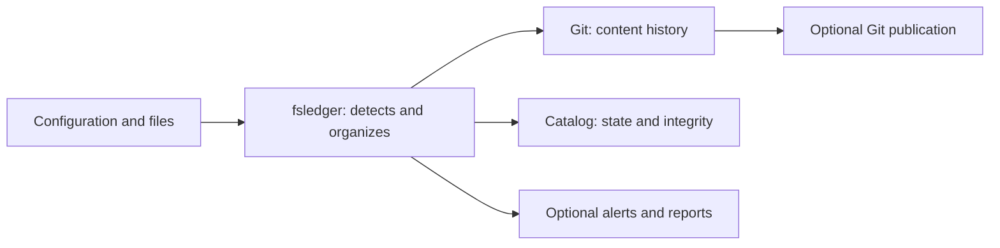

# fsledger

**Change history, file integrity, and alerts for your Linux servers.**

fsledger tracks how your services' configuration and files evolve.
You can preserve their contents in Git, check their integrity without copying them,
or combine both approaches. When the system provides the information, it records
the observed user and process to help you investigate what changed.

## Contents

- [Use cases](#use-cases)
- [Features](#features)
- [Comparison with similar tools](#comparison-with-similar-tools)
- [Architecture](#architecture)
- [Requirements](#requirements)
- [Installation](#installation)
- [Getting started](#getting-started)
- [Configuration](#configuration)
- [Everyday use](#everyday-use)
- [Data protection](#data-protection)
- [License](#license)

## Use cases

- **Understand configuration changes.** Keep versions of `/etc` and your applications'
  configuration to compare their previous and current states.
- **Monitor websites and services.** Detect changes to contents, permissions, ownership,
  and other attributes, and compare them against an approved baseline.
- **Review activity without following every event.** Receive grouped alerts or scheduled
  reports with the affected paths and observed changes.
- **Handle each service's needs separately.** Store the configuration you want to version
  in Git and use metadata inventories for trees whose contents you do not need to archive.
- **Share history beyond the server.** Publish repositories to your Git server and,
  if explicitly enabled, apply changes from a trusted branch.

## Features

- **Automatic Git history.** Each repository keeps an independent copy of its sources,
  with grouped commits and recognizable paths. It does not add `.git` to application
  directories.
- **Integrity with explicit approval.** Compare hashes and attributes against an approved
  baseline or the previous observation. SHA256 is the default algorithm.
- **Context for investigations.** Use information available from fanotify, `/proc`,
  and Linux Audit to enrich changes with user and process details. If the actor cannot
  be identified, the change is still recorded with an unknown actor.
- **Detection adapted to your environment.** Combine fanotify, inotify, and reconciliation,
  or use interval or cron scans when you prefer scheduled traversal.
- **Noise control.** Filter alerts by user, command, or path, group notifications,
  and defer commits for frequent changes while retaining the latest observed pending version.
- **Alerts and reports.** Send alerts by email or Slack and scheduled summaries by email.
  Pending queues survive restarts.
- **Optional AI.** Add summaries to commits or reports, with path selection and redaction
  rules applied before information is sent to the provider.
- **CLI administration.** Validate configuration, check status, diagnose capabilities,
  review differences, and approve changes. Includes OpenRC and systemd integration.

## Comparison with similar tools

These tools address related needs. The choice depends on whether you want to automate
Git, manage `/etc`, or verify file integrity.

| Tool | Main focus |
| --- | --- |
| [gitwatch][gitwatch] | Automatically commit changes to a file or directory, with optional publication. |
| [etckeeper][etckeeper] | Version `/etc`, preserve metadata, and integrate with package managers. |
| [AIDE][aide] | Check file contents and attributes against a reference database. |
| **fsledger** | Combine Git mirrors, integrity inventories, available attribution, alerts, and reports. |

**gitwatch** is a good fit if you already work with a repository and want to automate
commits when saving files. It provides a straightforward monitoring and versioning script.

**etckeeper** is a good fit if your priority is the history of `/etc` and its relationship
with package updates. It also records metadata that Git does not preserve on its own,
such as permissions.

**AIDE** is a good fit if your goal is to compare files and attributes against an integrity
baseline. fsledger can import an existing AIDE database to establish that baseline
without automatically approving the current state.

**fsledger** is a good fit when you need to manage multiple paths and services with their
own policies, choose between content in Git and metadata inventories, and combine that
tracking with process context, alerts, and reports. Git and DB profiles can monitor
the same sources to cover both uses.

The links in the table point to each project's official description.

## Architecture

fsledger organizes monitoring around your services: you choose what to watch,
what to preserve, and how to receive the results. You can start with a single directory
and add profiles with different policies as your needs grow.



**History kept separate from applications.** Git repositories store their own copies;
DB profiles preserve metadata without duplicating file contents. Both maintain an
integrity catalog. By default, fsledger observes the sources; writing to them requires
explicitly enabling bidirectional synchronization.

**Continuity for everyday operations.** Watchers detect events, and reconciliation checks
the state on disk. An unstable file retains its last valid copy while other files can
continue to be processed. Pending notifications are stored durably, and remote publication
failures do not stop local history from being recorded.

**Control per repository.** Each profile serializes its copy and Git operations,
while different repositories can work concurrently. A shared budget limits scanning work.
Report preparation and alert delivery run outside the copy and commit work.

The `fsledgerd` service handles monitoring, and the `fsledger` CLI provides administration.
Git preserves history, while a local Pebble catalog stores the inventory, approved
baselines, and pending work. No additional database server is required.

## Requirements

- **Linux** to run the daemon and CLI.
- **Git 2.28 or later** for content repositories.
- **Go 1.27.1 or later and Make** to build from source. Production binaries are built
  without CGO and do not require Go to be installed at runtime.
- Read permissions on the sources and write permissions on state directories.
  fanotify may require additional privileges; automatic mode provides alternatives
  using inotify and polling.
- Access to a Git remote, notification transport, or AI provider only if you enable
  those features. Schedules with a time zone require the corresponding IANA time zone data.

## Installation

### Prebuilt Linux x86_64 binaries

Published [GitHub releases](https://github.com/inode64/fsledger/releases) attach
`fsledger-linux-x86_64`, `fsledgerd-linux-x86_64`, `LICENSE`, and `SHA256SUMS` after
the project checks pass. Both binaries include the release tag in `--version`, are
built without CGO, and use `GOAMD64=v1` for compatibility with older x86-64 CPUs.

Download all four assets from the same release and verify them before use:

```sh
sha256sum --check SHA256SUMS
chmod +x fsledger-linux-x86_64 fsledgerd-linux-x86_64
./fsledger-linux-x86_64 --version
./fsledgerd-linux-x86_64 --version
```

The assets contain the executables; configuration examples, manual pages, and service
files are available in the source archive for the same tag. Review the configuration
as described in [Getting started](#getting-started) before running the daemon.

### Building from source

```sh
git clone https://github.com/inode64/fsledger.git
cd fsledger
make build
sudo make install
```

Installation adds both binaries, manual pages, and configuration examples.
It does not overwrite existing configuration files or start the service.
The default destinations are `/usr/bin/fsledger`, `/usr/sbin/fsledgerd`, and
`/etc/fsledger`. You can adjust them using `PREFIX`, `SYSCONFDIR`, and the other
installation variables in the [Makefile](Makefile); `DESTDIR` supports package staging.

Make uses `GOAMD64=v1` by default to maintain compatibility with older x86-64 CPUs.
You can identify a build with `make build VERSION=v1.2.3` and check the result
using `fsledger --version`.

**Before starting**, review the installed profiles. `system` selects configuration
for Git; `web-polling` selects `/srv/www` for a nightly inventory and enables email
with example settings. Configure that notifier or disable its alerts and reports.
To start with only `system`, set `paths.repositories: [services/system.yaml]`
in the main YAML file. See [Getting started](#getting-started) to validate the selection.

### OpenRC

```sh
sudo make install-openrc
sudoedit /etc/fsledger/fsledger.yaml
sudo rc-service fsledger checkconfig
sudo rc-update add fsledger default
sudo rc-service fsledger start
sudo rc-service fsledger status
```

You can select a different YAML file in `/etc/conf.d/fsledger` using `fsledger_config`.
To apply configuration changes, run `sudo rc-service fsledger restart`.

### systemd

```sh
sudo make install-systemd
sudoedit /etc/fsledger/fsledger.yaml
sudo fsledger check
sudo systemctl daemon-reload
sudo systemctl enable --now fsledger
sudo journalctl -u fsledger -f
```

To apply configuration changes, run `sudo systemctl restart fsledger`.
The [included unit](packaging/fsledger.service) restricts writable paths;
adjust its configuration if you customize storage or enable writes to the sources.

### Upgrading

Download or check out the new source version, rebuild, and install the binaries
with `sudo make install-bin install-man`. This target updates binaries and manual pages
without adding example profiles. Validate the YAML with the new CLI and restart the service
to use the new executable. Keep the previous version so you can revert an upgrade if needed.

## Getting started

Review the main configuration and profiles before the first startup:

```sh
sudoedit /etc/fsledger/fsledger.yaml
sudoedit /etc/fsledger/services/system.yaml
sudo fsledger check -c /etc/fsledger/fsledger.yaml
sudo fsledger doctor -c /etc/fsledger/fsledger.yaml
```

`check` validates the options and selected paths. `doctor` checks the environment's
capabilities and shows the available detectors. For an initial foreground run,
with the service stopped:

```sh
sudo fsledger run -c /etc/fsledger/fsledger.yaml
```

Stop that run before starting the OpenRC or systemd service. The daemon prepares
repositories automatically and performs an initial scan by default. A polling profile
with `on_start: false` waits for its schedule.

With the service running, you can check its status and the history of `system`:

```sh
sudo fsledger status
sudo git -C /var/lib/fsledger/repos/system log --stat
sudo git -C /var/lib/fsledger/repos/system log -p -- etc/ssh/sshd_config
```

Mirror paths preserve the structure relative to `/`: for example,
`/etc/ssh/sshd_config` is stored as `etc/ssh/sshd_config` inside the repository.
You can inspect and extract versions with standard Git tools.

## Configuration

The main configuration defines shared policies and where to load profiles from.
Each repository can adjust its own options. Omitted fields inherit the global value,
and unknown fields are rejected to catch configuration errors.

### Paths and reusable profiles

A minimal main configuration file:

```yaml
paths:
  repositories: [services]
runtime: /run/fsledger
storage:
  path: /var/lib/fsledger/repos
```

A `services/system.yaml` profile for versioning configuration:

```yaml
type: git
paths:
  - /etc
  - /usr/src/linux/.config
  - /var/spool/fcron/*.orig
notifications:
  use: []
```

The file name determines the repository name. Profile directory paths are relative
to the main YAML file; sources use absolute paths or patterns over them.
Missing entries are skipped without error and included when they appear in a subsequent
reconciliation. Selection supports `*`, `?`, and `[...]` within each path component;
recursive `**` patterns are reserved for exclusions and other filters that support them.

You can use `${HOST}` or `$HOST` in YAML values and keys. They expand to the `HOST`
environment variable or, if it is unset, the system hostname.
See the [complete configuration example](examples/fsledger.yaml) to add reusable
exclusion profiles, notifiers, and templates.

### Continuous or scheduled monitoring

`watch.backend: auto` selects detectors based on the available capabilities and maintains
reconciliation. To scan a tree on a specific schedule, use a DB profile with polling:

```yaml
type: db
paths: [/srv/www]
watch:
  backend: polling
  reconcile:
    schedule: "15 3 * * *"
    timezone: UTC
    on_start: false
    on_stop: false
integrity:
  hash:
    full_scan_schedule: "15 3 * * *"
    full_scan_timezone: UTC
```

This example scans the tree and computes full hashes at 03:15 UTC. Cron expressions
have five fields; you can also choose intervals. A scheduled scan observes the state
that exists when it runs, so it does not capture changes that appear and disappear
between scans. The [complete nightly profile](examples/services/web-polling.yaml)
adds email alerts and reports.

### Integrity and change approval

Git and DB repositories maintain an inventory of hashes and attributes. Choose
`integrity.reference: baseline` to compare against an approved baseline, or `previous`
to track changes relative to the previous observation.

With the daemon stopped, explicitly establish an initial baseline from a state
you have reviewed and consider trustworthy:

```sh
sudo fsledger baseline init --repository system
sudo fsledger verify --repository system
sudo fsledger changes --repository system
```

To approve a specific difference:

```sh
sudo fsledger baseline accept --repository system --change ID
```

The baseline is not updated automatically when changes arrive. If you already use AIDE,
you can import its text or gzip database into an empty catalog:

```sh
sudo fsledger migrate_aide /var/lib/aide/aide.db system
```

Import preserves the original baseline and applies the profile's paths and exclusions;
it does not approve the files as they currently exist. Inventory, approval, and import
commands require exclusive access with the daemon stopped.

### Alerts and reports

Immediate alerts support email and Slack, templates, and change grouping.
`notifications.ignore` filters change alerts by user, command, or path; it does not alter
the inventory, integrity violations, or reports. `commit.defer` lets you defer commits
for specific paths or actors until another non-deferred change or a `flush`.
There is no maximum delay, and the latest observed pending version survives restarts.

Reports have their own schedule. This fragment can be added to the main YAML file
or a profile and requires a configured `email-ops` email notifier:

```yaml
reports:
  enabled: true
  format: summary
  schedule: "0 8 * * *"
  timezone: Europe/Madrid
  use: [email-ops]
  send_empty: false
```

`summary` brings together totals for the period and a sample of paths; `detailed` sends
the details split into bounded parts. Reports are disabled by default.
Their journal is independent of immediate alerts and preserves pending evidence
across restarts or delivery failures. Gaps in observation are flagged as incomplete
coverage. Counts represent observations, not commits or unique files.

You can configure the transport using the [email](examples/notifiers/email-ops.yaml)
and [Slack](examples/notifiers/slack-ops.yaml) examples, and customize alerts with the
[included templates](examples/templates). Report schedules are independent of scanning:
choose their timing based on how long your scans actually take.

### Git publication and synchronization

To publish a Git repository's history, add this to its profile:

```yaml
storage:
  git:
    remote: ssh://git@git.example/configuration.git
    branch: main
    push_interval: 1m
    push_timeout: 30s
```

Configure credentials in SSH or Git. fsledger publishes only the specified branch,
without force pushes, and retries network failures while continuing to record local changes.

If you also want to apply changes from that branch, enable
`storage.git.bidirectional: true`. Publish the local history first and work from
a clone of that same history. Only *fast-forward* updates are accepted; pending local
changes take priority, and conflicts require manual resolution.

This option allows sources to be modified with the daemon's permissions: use a trusted
branch and authorize its writable paths in systemd. Replacements are atomic per file,
not across the entire tree; an interruption can leave partial changes, and there is
no automatic rollback. The journal allows pending work to be recovered after a restart.
See [fsledger.yaml(5)](packaging/man/fsledger.yaml.5) for details.

### AI summaries

AI profiles are loaded from `ai/`, alongside the main YAML file. To add summaries
to a Git repository's commits, select an existing profile and the allowed paths:

```yaml
ia_commit: [resumen]
ia_include: [/etc/ssh/sshd_config]
```

OpenAI, Anthropic, and OpenAI-compatible endpoints are supported. Redaction rules
are applied to contents before building the diff sent to the provider. An AI failure
allows the commit to proceed with its usual message.

Reports can enable `reports.ai` separately. In that case, only selected metadata is sent,
without file contents, attribute values, or process commands. Both features are disabled
by default. Profile configuration and selection are described in
[fsledger.yaml(5)](packaging/man/fsledger.yaml.5).

## Everyday use

With the default configuration at `/etc/fsledger/fsledger.yaml`:

```sh
fsledger check --effective
fsledger doctor
fsledger status
fsledger flush --repository system
```

`check --effective` shows the resolved configuration without credentials. `status` brings
together repositories, detectors, scans, pending changes, and Git publication. `flush`
asynchronously requests processing of deferred Git changes; check `status` afterward
to confirm the result. Add `-c PATH` to commands if you use a different main configuration file.

With the daemon stopped, you can preview a pending report without consuming it,
calling AI, or sending email:

```sh
fsledger report preview --repository system
```

Also with the daemon stopped, `outbox clear` discards every notification queued by a
repository without sending it, for example when its mail relay cannot accept them.
Recorded changes stay in the catalog:

```sh
fsledger outbox clear --repository system
```

The service logs to stderr by default. To write a log file, set `logging.file` to an
absolute path; `logging.level` accepts `debug`, `info`, `warning`, and `error`.
Rotation is external and requires a restart to reopen the file.
Configuration changes also require a service restart.

The installed manuals, `man fsledger`, `man fsledgerd`, and `man 5 fsledger.yaml`, provide
more detail on commands and options. You can also read [fsledger(1)](packaging/man/fsledger.1)
and [fsledgerd(8)](packaging/man/fsledgerd.8) in the repository.

## Data protection

- **Choose what to archive before starting.** A secret that enters Git can remain
  in its history even if you exclude it later. AI redaction rules protect the provider's
  input; they do not change or encrypt archived bytes.
- **Separate contents and metadata.** Git stores contents, symlinks, and the executable
  bit; the catalog records selected attributes such as ownership, permissions, ACLs,
  or xattrs. Git does not preserve empty directories or all those metadata fields in its tree.
- **Keep sources outside managed state.** Do not edit mirrors while the daemon is running.
  Storage and runtime directories must be private and are automatically excluded from
  that instance's sources. Independent instances need shared exclusions.
- **Configure exclusions for your applications.** They support recursive globs such as `**`,
  and global and repository rules are combined. Start with the
  [example profile](examples/excludes/common.yaml) and adjust it for caches, temporary files, and secrets.
- **Protect access to the remote.** Branch restrictions control who can write,
  not who can read other branches. Use separate private repositories when you need
  to separate access to the data.

Symlinks are preserved as links and are not followed during copying.
Attribution identifies what the system could observe: it does not guarantee identifying
every process or preserving every intermediate version of concurrent writes.
The priority is to preserve the observed state without inventing an identity.

Process command lines are used only in memory for local `command_regex` filters.
Commits, catalog evidence, and notifications record the available user, PID, and executable,
without process arguments. Git failures report exit status or cancellation without
including command arguments or hook output in status, logs, or alerts.

## License

fsledger is free software licensed under **GPL-3.0-or-later**. You can redistribute
and modify it under version 3 of the GNU General Public License or any later version.
It is distributed without warranty. See [LICENSE](LICENSE).

[gitwatch]: https://github.com/gitwatch/gitwatch
[etckeeper]: https://etckeeper.branchable.com/
[aide]: https://aide.github.io/
